# Ignite Solutions — Platform Deployment Guide

## Table of Contents
1. [Infrastructure Overview](#1-infrastructure-overview)
2. [Prerequisites](#2-prerequisites)
3. [Terraform — Provision Infrastructure](#3-terraform--provision-infrastructure)
4. [Backend — Docker Build, ECR Push, Helm & ArgoCD Deploy](#4-backend--docker-build-ecr-push-helm--argocd-deploy)
5. [Frontend — Build & Deploy to S3 + CloudFront](#5-frontend--build--deploy-to-s3--cloudfront)
6. [Database — RDS Setup & Migrations](#6-database--rds-setup--migrations)
7. [ArgoCD — Auto Sync on Image Change](#7-argocd--auto-sync-on-image-change)
8. [GitHub Actions Pipelines](#8-github-actions-pipelines)
9. [OIDC — Keyless AWS Authentication](#9-oidc--keyless-aws-authentication)
10. [Kubernetes Secrets for RDS](#10-kubernetes-secrets-for-rds)
11. [Connecting to Database Locally](#11-connecting-to-database-locally)
12. [End-to-End Testing](#12-end-to-end-testing)

---

## 1. Infrastructure Overview

| Component        | Technology                        | Region       |
|-----------------|-----------------------------------|--------------|
| Container Cluster | Amazon EKS 1.30                 | ap-south-1   |
| Container Registry | Amazon ECR                     | ap-south-1   |
| Database         | Amazon RDS MySQL 8.0 (db.t3.micro)| ap-south-1   |
| Object Storage   | Amazon S3                         | ap-south-1   |
| CDN              | Amazon CloudFront                 | Global       |
| Load Balancer    | AWS ALB (via AWS Load Balancer Controller) | ap-south-1 |
| IaC              | Terraform                         | —            |
| GitOps           | ArgoCD                            | In-cluster   |
| CI/CD            | GitHub Actions + OIDC             | —            |

---

## 2. Prerequisites

```bash
# Tools required
terraform >= 1.5.0
kubectl >= 1.28
helm >= 3.12
aws cli >= 2.x
docker >= 24.x
argocd cli >= 2.14.7

# AWS CLI configuration
aws configure
# AWS Access Key ID: <access_key>
# AWS Secret Access Key: <secret_key>
# Default region: ap-south-1

# Update kubeconfig for EKS
aws eks update-kubeconfig --name demo-eks --region ap-south-1

# Verify cluster access
kubectl get nodes
```


---

## 3. Terraform — Provision Infrastructure

### Directory Structure
```
terraform/
├── modules/
│   ├── vpc/        # VPC, subnets, NAT gateway
│   ├── eks/        # EKS cluster + managed node group
│   ├── ecr/        # ECR repositories
│   ├── rds/        # RDS MySQL + security group
│   ├── s3/         # S3 frontend bucket
│   ├── cloudfront/ # CloudFront distribution
│   └── iam/        # GitHub OIDC role
└── envs/
    ├── dev/        # Dev environment tfvars
    └── prod/       # Prod environment tfvars
```

### Commands

```bash
# Initialize
cd terraform/envs/dev
terraform init

# Plan
terraform plan -out=tfplan

# Apply
terraform apply -auto-approve tfplan

# Key resources created:
# - VPC: vpc-0f07766b9f0f33e09 (10.0.0.0/16)
# - EKS Cluster: demo-eks (v1.30)
# - ECR: backend-api-dev, frontend-ui
# - RDS: platform-mysql-new (MySQL 8.0)
# - S3: central-platform-frontend-86161110
# - CloudFront: E1RI5RK3Y0BKEN
```

### RDS VPC Fix
> The original RDS was provisioned in a different VPC than EKS (both had CIDR 10.0.0.0/16 — VPC peering not possible).
> Fixed by creating a snapshot and restoring into the EKS VPC.

```bash
# Create snapshot
aws rds create-db-snapshot \
  --db-instance-identifier platform-mysql \
  --db-snapshot-identifier platform-mysql-migration-snapshot \
  --region ap-south-1

# Create subnet group in EKS VPC
aws rds create-db-subnet-group \
  --db-subnet-group-name eks-vpc-db-subnet-group \
  --db-subnet-group-description "RDS subnet group in EKS VPC" \
  --subnet-ids subnet-00a687675422c5b1d subnet-0fc4ca2bebf2aef42 \
  --region ap-south-1

# Restore into correct VPC
aws rds restore-db-instance-from-db-snapshot \
  --db-instance-identifier platform-mysql-new \
  --db-snapshot-identifier platform-mysql-migration-snapshot \
  --db-instance-class db.t3.micro \
  --db-subnet-group-name eks-vpc-db-subnet-group \
  --vpc-security-group-ids sg-09b2b19b95099274d \
  --no-publicly-accessible \
  --region ap-south-1

# Wait for availability
aws rds wait db-instance-available \
  --db-instance-identifier platform-mysql-new \
  --region ap-south-1
```

---

## 4. Backend — Docker Build, ECR Push, Helm & ArgoCD Deploy

### 4.1 Application Structure

```
backend-services/users-api/
├── app.py              # Flask application
├── Dockerfile          # Container definition
├── requirements.txt    # Python dependencies
└── backend-api/        # Helm chart
    ├── Chart.yaml
    ├── values.yaml
    ├── values-dev.yaml
    ├── values-prod.yaml
    └── templates/
        ├── deployment.yaml
        ├── service.yaml
        ├── ingress.yaml
        └── serviceaccount.yaml
```

### 4.2 Dockerfile

```dockerfile
FROM python:3.11-slim
WORKDIR /app
COPY requirements.txt .
RUN pip install -r requirements.txt
COPY . .
EXPOSE 5000
CMD ["gunicorn", "-b", "0.0.0.0:5000", "app:app"]
```

### 4.3 ECR Login & Push

```bash
# Authenticate Docker to ECR
aws ecr get-login-password --region ap-south-1 | \
  docker login --username AWS \
  --password-stdin 758024567313.dkr.ecr.ap-south-1.amazonaws.com

# Build image
cd backend-services/users-api
docker build -t backend-api-dev:latest .

# Tag for ECR
docker tag backend-api-dev:latest \
  758024567313.dkr.ecr.ap-south-1.amazonaws.com/backend-api-dev:latest

docker tag backend-api-dev:latest \
  758024567313.dkr.ecr.ap-south-1.amazonaws.com/backend-api-dev:dev-latest

# Push to ECR
docker push 758024567313.dkr.ecr.ap-south-1.amazonaws.com/backend-api-dev:latest
docker push 758024567313.dkr.ecr.ap-south-1.amazonaws.com/backend-api-dev:dev-latest

# Verify
aws ecr list-images \
  --repository-name backend-api-dev \
  --region ap-south-1
```
  
### 4.4 Helm Chart Deploy

```bash
# Deploy to dev namespace manually
helm upgrade --install backend-api-dev \
  backend-services/users-api/backend-api \
  -f backend-services/users-api/backend-api/values-dev.yaml \
  --namespace dev \
  --create-namespace

# Deploy to prod namespace manually
helm upgrade --install backend-api-prod \
  backend-services/users-api/backend-api \
  -f backend-services/users-api/backend-api/values-prod.yaml \
  --namespace prod \
  --create-namespace

# Verify
kubectl get pods -n dev
kubectl get pods -n prod
kubectl get svc -n dev
kubectl get ingress -n dev
```

### 4.5 ArgoCD Application Setup

```bash
# Apply ArgoCD application manifests
kubectl apply -f argocd/backend-dev.yaml
kubectl apply -f argocd/backend-prod.yaml

# Check sync status
kubectl get applications -n argocd
  

# Manual sync via CLI
argocd login <ARGOCD_SERVER> \
  --username admin \
  --password <PASSWORD> \
  --insecure --grpc-web

argocd app sync backend-api-dev --grpc-web
argocd app sync backend-api-prod --grpc-web

# Watch sync status
argocd app wait backend-api-dev --sync --health --grpc-web
```

### 4.6 ArgoCD Application Manifest (dev)

```yaml
# argocd/backend-dev.yaml
apiVersion: argoproj.io/v1alpha1
kind: Application
metadata:
  name: backend-api-dev
  namespace: argocd
spec:
  source:
    repoURL: https://github.com/Avenis3010/ignite-solutions.git
    targetRevision: dev          # tracks dev branch
    path: backend-services/users-api/backend-api
    helm:
      valueFiles:
        - values-dev.yaml
  destination:
    namespace: dev
  syncPolicy:
    automated:
      prune: true
      selfHeal: true
    syncOptions:
      - CreateNamespace=true
```

### 4.7 Ingress — Path-Based Routing

Both dev and prod share a single ALB using `alb.ingress.kubernetes.io/group.name: shared-alb`:

| Path   | Namespace | Service          | Port |
|--------|-----------|------------------|------|
| `/dev` | dev       | backend-api-dev  | 5000 |
| `/prod`| prod      | backend-api-prod | 5000 |

**ALB Endpoint:** `k8s-sharedalb-335d1a2116-417986850.ap-south-1.elb.amazonaws.com`

---

## 5. Frontend — Build & Deploy to S3 + CloudFront

### 5.1 Build

```bash
cd frontend-services/frontend-apps/web-ui

# Install dependencies
npm ci

# Build production bundle
npm run build
# Output: frontend-services/frontend-apps/web-ui/build/
```

### 5.2 Deploy to S3

```bash
# Deploy dev build
aws s3 sync frontend-services/frontend-apps/web-ui/build/ \
  s3://central-platform-frontend-86161110/dev/ --delete

# Deploy prod build
aws s3 sync frontend-services/frontend-apps/web-ui/build/ \
  s3://central-platform-frontend-86161110/prod/ --delete

# Verify
aws s3 ls s3://central-platform-frontend-86161110/dev/
aws s3 ls s3://central-platform-frontend-86161110/prod/
```

### 5.3 CloudFront Cache Invalidation

```bash
# Invalidate dev path
aws cloudfront create-invalidation \
  --distribution-id E1RI5RK3Y0BKEN \
  --paths "/dev/*"

# Invalidate prod path
aws cloudfront create-invalidation \
  --distribution-id E1RI5RK3Y0BKEN \
  --paths "/prod/*"
```

---

## 6. Database — RDS Setup & Migrations

### 6.1 RDS Details

| Property       | Value                                                              |
|---------------|--------------------------------------------------------------------|
| Identifier    | platform-mysql-new                                                 |
| Engine        | MySQL 8.0.45                                                       |
| Instance Class| db.t3.micro                                                        |
| Endpoint      | platform-mysql-new.cvi2swcoup2y.ap-south-1.rds.amazonaws.com      |
| VPC           | vpc-0f07766b9f0f33e09 (same as EKS)                               |
| Subnet Group  | eks-vpc-db-subnet-group (private subnets)                          |
| Public Access | false                                                              |
| Database      | platform                                                           |

### 6.2 Migration Files

```sql
-- migrations/dev/001_create_users.sql
CREATE DATABASE IF NOT EXISTS platform;
USE platform;
CREATE TABLE IF NOT EXISTS users (
    id         INT AUTO_INCREMENT PRIMARY KEY,
    name       VARCHAR(100) NOT NULL,
    email      VARCHAR(255) UNIQUE,
    created_at TIMESTAMP DEFAULT CURRENT_TIMESTAMP,
    last_login TIMESTAMP NULL
);
```

### 6.3 Run Migration via Kubernetes Job

```bash
# Create namespace and secret
kubectl create namespace dev --dry-run=client -o yaml | kubectl apply -f -

kubectl create secret generic rds-secret -n dev \
  --from-literal=DB_HOST=platform-mysql-new.cvi2swcoup2y.ap-south-1.rds.amazonaws.com \
  --from-literal=DB_NAME=platform \
  --from-literal=DB_USER=admin \
  --from-literal=DB_PASSWORD=<DB_PASSWORD> \
  --dry-run=client -o yaml | kubectl apply -f -

# Apply configmap with SQL
kubectl apply -f migrations/dev/configmap.yaml

# Run migration job
kubectl delete job mysql-migration -n dev --ignore-not-found=true
kubectl apply -f migrations/dev/migration-job.yaml

# Wait for completion
kubectl wait --for=condition=complete job/mysql-migration -n dev --timeout=300s

# Check logs
kubectl logs job/mysql-migration -n dev
```

### 6.4 Connect to Database Locally (via kubectl port-forward)

```bash
# Step 1 — Run a proxy pod in the cluster
kubectl run mysql-proxy --image=mysql:8.0 --restart=Never -n dev \
  -- sh -c "while true; do sleep 3600; done"

# Step 2 — Wait for pod to be ready
kubectl wait --for=condition=Ready pod/mysql-proxy -n dev --timeout=60s

# Step 3 — Install socat and start tunnel (keep this terminal open)
kubectl exec -n dev mysql-proxy -- sh -c \
  "apt-get install -y socat -qq && \
   socat TCP-LISTEN:3306,fork \
   TCP:platform-mysql-new.cvi2swcoup2y.ap-south-1.rds.amazonaws.com:3306 &"

kubectl port-forward pod/mysql-proxy 3306:3306 -n dev

# Step 4 — Connect from new terminal
mysql -h 127.0.0.1 -P 3306 -u admin -p platform

# Step 5 — Cleanup
kubectl delete pod mysql-proxy -n dev
```

### 6.5 Verify Database from EKS Pod

```bash
# Run one-off query job
kubectl run db-check --image=mysql:8.0 --restart=Never -n dev \
  --command -- mysql \
    -h platform-mysql-new.cvi2swcoup2y.ap-south-1.rds.amazonaws.com \
    -u admin -pStrongPassword123! \
    -e "SHOW DATABASES; USE platform; SHOW TABLES; DESCRIBE users;"

kubectl wait --for=jsonpath='{.status.phase}'=Succeeded pod/db-check -n dev --timeout=60s
kubectl logs db-check -n dev
kubectl delete pod db-check -n dev
```

---

## 7. ArgoCD — Auto Sync on Image Change

When a new image is pushed to ECR, the pipeline updates `values-dev.yaml` or `values-prod.yaml` with the new image tag and commits it back to the branch. ArgoCD detects the Git change and automatically redeploys.
   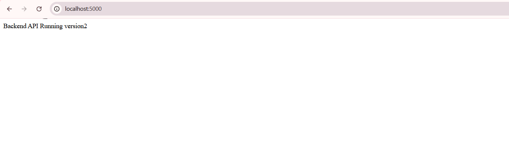

```
Push code → GitHub Actions builds image → pushes to ECR
         → updates values-dev.yaml with new tag → commits to dev branch
         → ArgoCD detects Git diff → syncs Helm release → rolling update
```

### Verify Auto Sync

```bash
# Watch ArgoCD sync in real time
kubectl get applications -n argocd -w

# Check current deployed image
kubectl get deployment backend-api-dev -n dev \
  -o jsonpath="{.spec.template.spec.containers[0].image}"

# Force sync manually if needed
argocd app sync backend-api-dev --grpc-web --force

# Terminate stuck operation
argocd app terminate-op backend-api-dev --grpc-web

# Check rollout status
kubectl rollout status deployment/backend-api-dev -n dev
kubectl rollout status deployment/backend-api-prod -n prod
```

### aws-auth ConfigMap — Grant GitHub Actions kubectl Access

```bash
# github-oidc-role must be in aws-auth for kubectl to work from CI
kubectl edit configmap aws-auth -n kube-system

# Added entry:
# - rolearn: arn:aws:iam::758024567313:role/github-oidc-role
#   username: github-actions
#   groups:
#     - system:masters
```

---

## 8. GitHub Actions Pipelines

### Branch Strategy

| Branch       | Pipeline        | Trigger                        |
|-------------|-----------------|--------------------------------|
| `dev`        | Dev Pipeline    | Push to `dev` branch           |
| `production` | Prod Pipeline   | Push to `production` branch    |

### Path-Based Job Filtering (dorny/paths-filter)

Each pipeline has 3 independent jobs. Only the job matching the changed path runs:

| Changed Path         | Job Triggered         |
|---------------------|-----------------------|
| `backend-services/` | Build & Deploy Backend|
| `frontend-services/`| Build & Deploy Frontend|
| `migrations/dev/`   | Database Migration    |
| `migrations/prod/`  | Database Migration    |

### Dev Pipeline Flow

```
push to dev
    │
    ▼
detect-changes (dorny/paths-filter)
    │
    ├── backend changed? ──► build-backend
    │                           ├── ECR login
    │                           ├── docker build & push (:sha + :dev-latest)
    │                           ├── update values-dev.yaml tag
    │                           ├── git commit & push
    │                           ├── argocd sync backend-api-dev
    │                           └── argocd wait healthy
    │
    ├── frontend changed? ──► build-frontend
    │                           ├── npm ci && npm run build
    │                           ├── aws s3 sync → /dev/
    │                           └── cloudfront invalidation /dev/*
    │
    └── migrations/dev changed? ──► database-migration
                                    ├── kubectl apply secret
                                    ├── kubectl apply configmap
                                    ├── kubectl delete old job
                                    ├── kubectl apply migration-job
                                    └── kubectl wait complete
```
  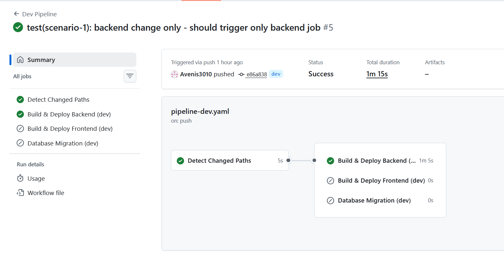
  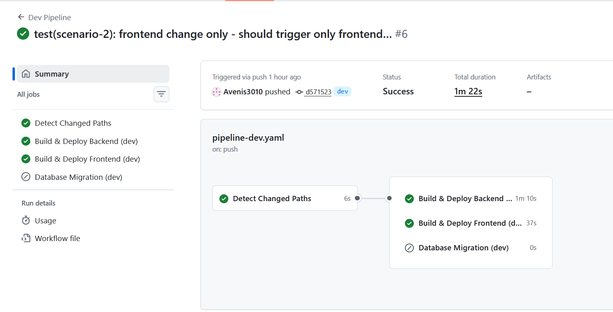
   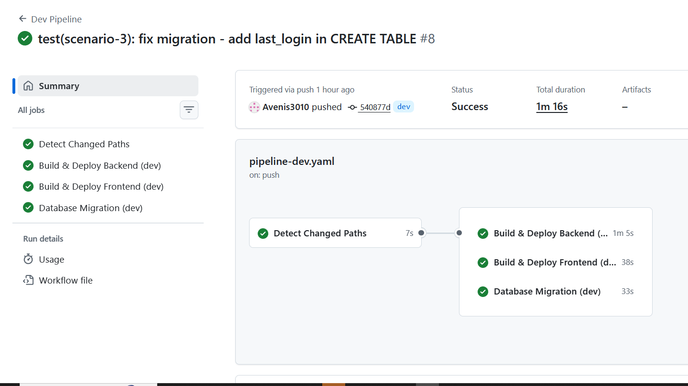
   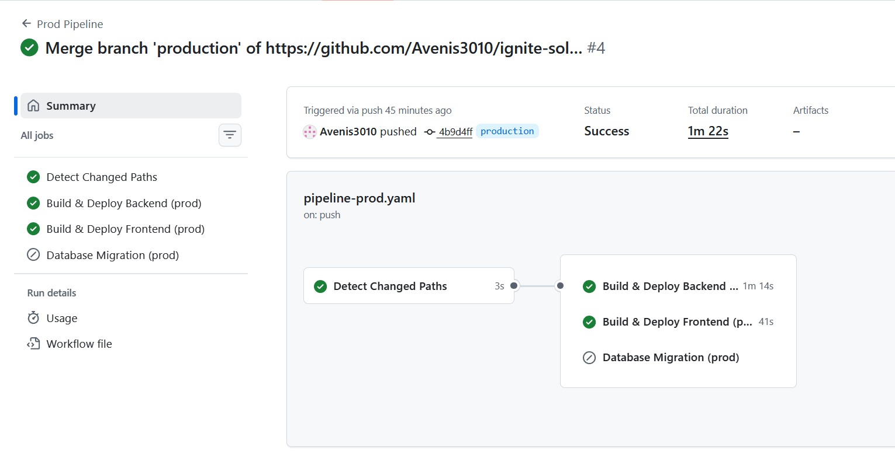
### Workflow Files

```
.github/workflows/
├── pipeline-dev.yaml       # Dev pipeline (push to dev)
├── pipeline-prod.yaml      # Prod pipeline (push to production)
├── build-backend.yaml      # Legacy backend build (push to main)
├── build-frontend.yaml     # Legacy frontend build (push to main)
├── deploy-argocd.yaml      # Legacy ArgoCD deploy
├── db-migration-dev.yml    # Manual dev migration trigger
├── db-migration-prod.yml   # Manual prod migration trigger
├── terraform.yaml          # Terraform plan/apply
└── integration-tests.yaml  # Health checks
```

---

## 9. OIDC — Keyless AWS Authentication

No AWS access keys stored in GitHub Secrets. GitHub Actions assumes an IAM role via OIDC.

### IAM Role Details

| Property    | Value                                                        |
|------------|--------------------------------------------------------------|
| Role Name  | github-oidc-role                                             |
| Role ARN   | arn:aws:iam::758024567313:role/github-oidc-role              |
| Trust      | repo:Avenis3010/ignite-solutions:*                           |

### Attached Policies

| Policy                              | Purpose                    |
|------------------------------------|----------------------------|
| AmazonEC2ContainerRegistryPowerUser | Push/pull ECR images       |
| AmazonS3FullAccess                  | Deploy frontend to S3      |
| AmazonEKSClusterPolicy              | EKS cluster operations     |
| CloudFrontFullAccess                | Cache invalidation         |
| SecretsManagerReadWrite             | Read/write secrets         |
| eks-describe (inline)               | update-kubeconfig          |

### Workflow Usage

```yaml
permissions:
  id-token: write
  contents: write

steps:
  - name: Configure AWS credentials
    uses: aws-actions/configure-aws-credentials@v4
    with:
      role-to-assume: arn:aws:iam::758024567313:role/github-oidc-role
      aws-region: ap-south-1
```

### Fix Trust Policy

```bash
aws iam update-assume-role-policy \
  --role-name github-oidc-role \
  --policy-document '{
    "Version": "2012-10-17",
    "Statement": [{
      "Effect": "Allow",
      "Principal": {
        "Federated": "arn:aws:iam::758024567313:oidc-provider/token.actions.githubusercontent.com"
      },
      "Action": "sts:AssumeRoleWithWebIdentity",
      "Condition": {
        "StringEquals": {
          "token.actions.githubusercontent.com:aud": "sts.amazonaws.com"
        },
        "StringLike": {
          "token.actions.githubusercontent.com:sub": "repo:Avenis3010/ignite-solutions:*"
        }
      }
    }]
  }'
```

---

## 10. Kubernetes Secrets for RDS

Secrets are never stored in Git. They are created in the cluster via `kubectl create secret --from-literal` using GitHub Secrets as the source.

```bash
# Dev namespace
kubectl create secret generic rds-secret -n dev \
  --from-literal=DB_HOST=platform-mysql-new.cvi2swcoup2y.ap-south-1.rds.amazonaws.com \
  --from-literal=DB_NAME=platform \
  --from-literal=DB_USER=admin \
  --from-literal=DB_PASSWORD=<DB_PASSWORD> \
  --dry-run=client -o yaml | kubectl apply -f -

# Prod namespace
kubectl create secret generic rds-secret -n prod \
  --from-literal=DB_HOST=platform-mysql-new.cvi2swcoup2y.ap-south-1.rds.amazonaws.com \
  --from-literal=DB_NAME=platform \
  --from-literal=DB_USER=admin \
  --from-literal=DB_PASSWORD=<DB_PASSWORD> \
  --dry-run=client -o yaml | kubectl apply -f -

# Verify (base64 decoded)
kubectl get secret rds-secret -n dev \
  -o jsonpath="{.data.DB_HOST}" | base64 -d
```

The secret is injected into the backend pod via the Helm deployment template:

```yaml
env:
  - name: DB_HOST
    valueFrom:
      secretKeyRef:
        name: rds-secret
        key: DB_HOST
  - name: DB_PASSWORD
    valueFrom:
      secretKeyRef:
        name: rds-secret
        key: DB_PASSWORD
```

---

## 11. Connecting to Database Locally

Since RDS is in a private subnet, direct connection from local machine is not possible.
Use kubectl port-forward via a proxy pod inside the cluster:

```bash
# 1. Run proxy pod
kubectl run mysql-proxy --image=mysql:8.0 --restart=Never -n dev \
  -- sh -c "while true; do sleep 3600; done"

# 2. Wait for ready
kubectl wait --for=condition=Ready pod/mysql-proxy -n dev --timeout=60s

# 3. Forward port (keep terminal open)
kubectl port-forward pod/mysql-proxy 3306:3306 -n dev &

# 4. Connect from local terminal
mysql -h 127.0.0.1 -P 3306 -u admin -p

# 5. Run queries
USE platform;
SHOW TABLES;
SELECT * FROM users;

  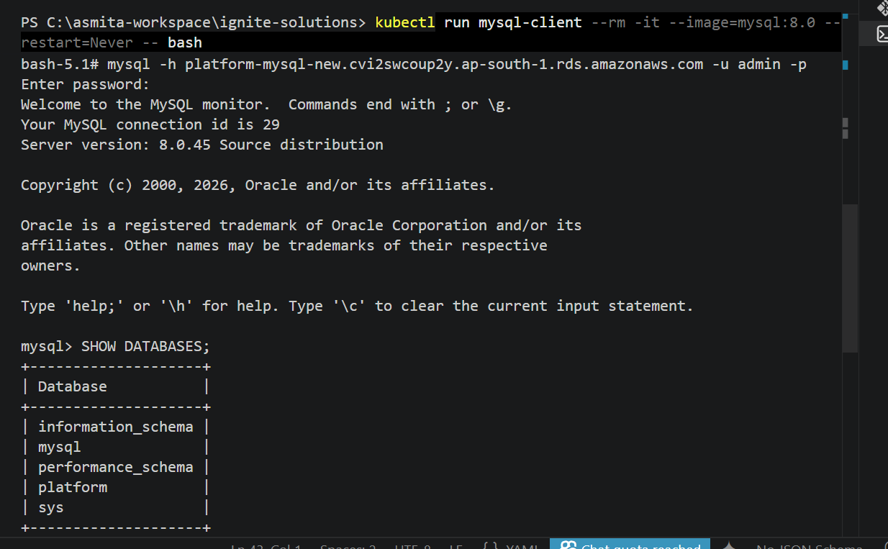

# 6. Cleanup
kubectl delete pod mysql-proxy -n dev
```

---

## 12. End-to-End Testing

### Backend Health Checks

```bash
ALB=k8s-sharedalb-335d1a2116-417986850.ap-south-1.elb.amazonaws.com

# Dev
curl http://$ALB/dev
# Response: Backend API Running - Environment: dev - v3.0

curl http://$ALB/dev/health
# Response: OK

# Prod
curl http://$ALB/prod
# Response: Backend API Running - Environment: prod - v3.0

curl http://$ALB/prod/health
# Response: OK
```
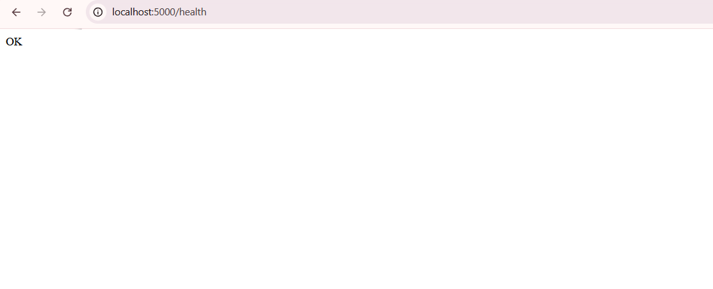

### Database Connectivity Test

```bash
kubectl run db-check --image=mysql:8.0 --restart=Never -n dev \
  --command -- mysql \
    -h platform-mysql-new.cvi2swcoup2y.ap-south-1.rds.amazonaws.com \
    -u admin -pStrongPassword123! \
    -e "USE platform; SELECT COUNT(*) FROM users;"

kubectl wait --for=jsonpath='{.status.phase}'=Succeeded pod/db-check -n dev --timeout=60s
kubectl logs db-check -n dev
kubectl delete pod db-check -n dev
```

### Pipeline Scenario Tests

| Scenario | Action | Expected |
|----------|--------|----------|
| Backend only | Commit to `backend-services/` on `dev` | Only backend job runs |
| Frontend only | Commit to `frontend-services/` on `dev` | Only frontend job runs |
| DB only | Commit to `migrations/dev/` on `dev` | Only database job runs |
| Prod deploy | Merge `dev` → `production` | Prod pipeline runs |

### ArgoCD Status

```bash
# Check all apps
kubectl get applications -n argocd

# Expected output:
# NAME               SYNC STATUS   HEALTH STATUS
# backend-api-dev    Synced        Healthy
# backend-api-prod   Synced        Healthy
```

---

## Screenshots

> Add screenshots of the following in this section:
> - `kubectl get nodes` output
      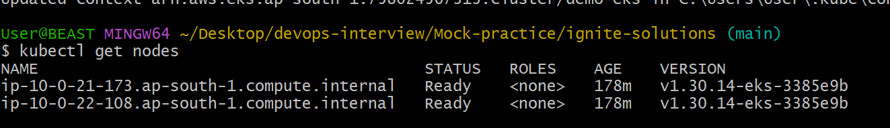
> - `kubectl get pods -n dev` and `kubectl get pods -n prod`
      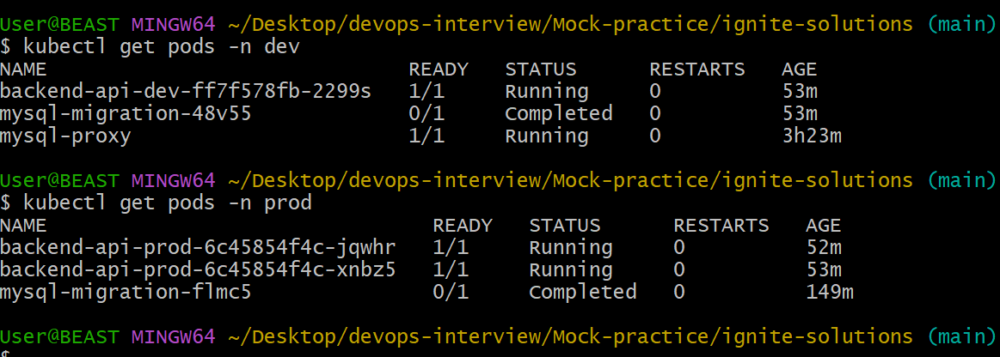
> - `kubectl get applications -n argocd`
       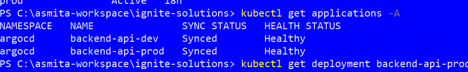
> - `kubectl get ingress --all-namespaces`
      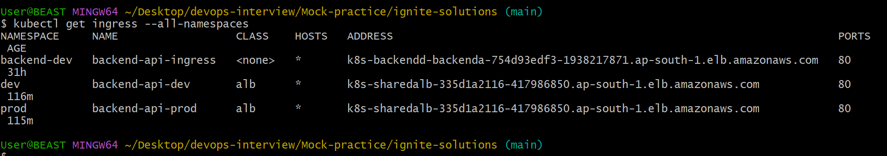
> - GitHub Actions pipeline runs showing path-filtered jobs
> - ArgoCD UI showing Synced/Healthy status
> - `curl` responses from `/dev` and `/prod` endpoints
> - AWS Console: ECR repository with pushed images
     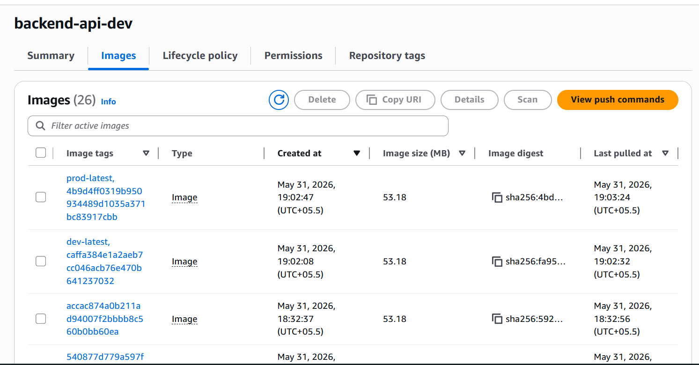
> - AWS Console: RDS instance in EKS VPC
    
> - AWS Console: S3 bucket with `/dev/` and `/prod/` prefixes
