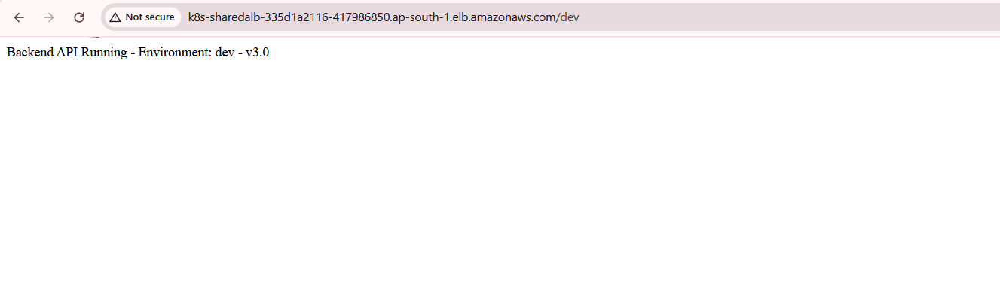
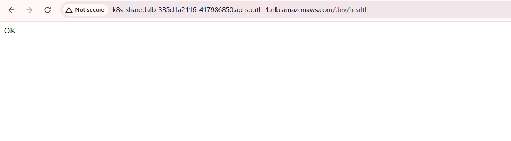
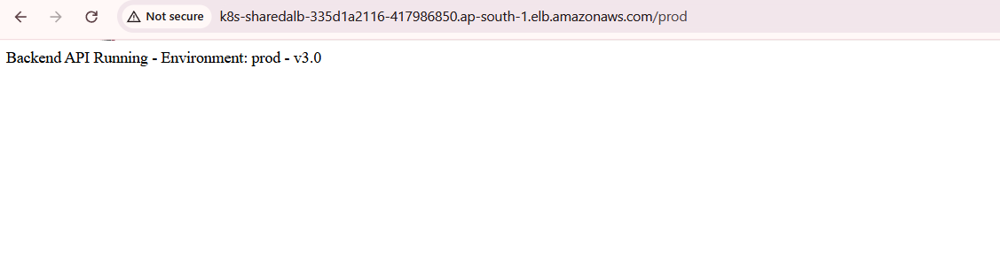
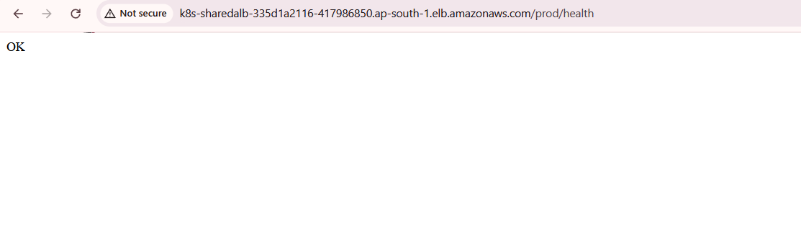

# Architecture & Design — Ignite Solutions Platform

## Table of Contents
1. [High-Level Architecture](#1-high-level-architecture)
2. [Network Architecture](#2-network-architecture)
3. [Security Architecture](#3-security-architecture)
4. [IAM Roles & Policies](#4-iam-roles--policies)
5. [Dev Pipeline Flow](#5-dev-pipeline-flow)
6. [Prod Pipeline Flow](#6-prod-pipeline-flow)
7. [ArgoCD GitOps Flow](#7-argocd-gitops-flow)
8. [Database Architecture](#8-database-architecture)
9. [Frontend Architecture](#9-frontend-architecture)

---

## 1. High-Level Architecture

```
┌─────────────────────────────────────────────────────────────────────────────┐
│                          INTERNET                                           │
└──────────────┬──────────────────────────────────┬───────────────────────────┘
               │                                  │
               ▼                                  ▼
   ┌───────────────────────┐          ┌───────────────────────┐
   │   AWS CloudFront CDN  │          │   AWS ALB             │
   │   d21650mrg2zm50      │          │   shared-alb          │
   │   .cloudfront.net     │          │   (internet-facing)   │
   └──────────┬────────────┘          └──────────┬────────────┘
              │                                  │
              │ /dev/*  /prod/*                  │ /dev  /prod
              ▼                                  ▼
   ┌───────────────────────┐     ┌───────────────────────────────────┐
   │   Amazon S3           │     │   Amazon EKS Cluster (demo-eks)   │
   │   central-platform-   │     │   ┌─────────────┬─────────────┐  │
   │   frontend-86161110   │     │   │  dev ns     │  prod ns    │  │
   │   /dev/               │     │   │  backend    │  backend    │  │
   │   /prod/              │     │   │  api-dev    │  api-prod   │  │
   └───────────────────────┘     │   │  (1 pod)    │  (2 pods)   │  │
                                 │   └──────┬──────┴──────┬──────┘  │
                                 │          │             │          │
                                 └──────────┼─────────────┼──────────┘
                                            │             │
                                            ▼             ▼
                                 ┌─────────────────────────────────┐
                                 │   Amazon RDS MySQL 8.0          │
                                 │   platform-mysql-new            │
                                 │   (private subnet, shared DB)   │
                                 │   Database: platform            │
                                 │   Table: users                  │
                                 └─────────────────────────────────┘
```

---

## 2. Network Architecture

```
┌─────────────────────────────────────────────────────────────────────┐
│  VPC: vpc-0f07766b9f0f33e09  (10.0.0.0/16)   ap-south-1            │
│                                                                      │
│  ┌──────────────────────────┐  ┌──────────────────────────┐         │
│  │  AZ: ap-south-1a         │  │  AZ: ap-south-1b         │         │
│  │                          │  │                          │         │
│  │  Public Subnet           │  │  Public Subnet           │         │
│  │  10.0.11.0/24            │  │  10.0.12.0/24            │         │
│  │  subnet-0098604145aea9ad8│  │  subnet-082eb82319ef7780e│         │
│  │  ┌──────────────────┐    │  │  ┌──────────────────┐    │         │
│  │  │  NAT Gateway     │    │  │  │  ALB             │    │         │
│  │  └──────────────────┘    │  │  └──────────────────┘    │         │
│  │                          │  │                          │         │
│  │  Private Subnet          │  │  Private Subnet          │         │
│  │  10.0.21.0/24            │  │  10.0.22.0/24            │         │
│  │  subnet-00a687675422c5b1d│  │  subnet-0fc4ca2bebf2aef42│         │
│  │  ┌──────────────────┐    │  │  ┌──────────────────┐    │         │
│  │  │  EKS Node        │    │  │  │  EKS Node        │    │         │
│  │  │  ip-10-0-21-173  │    │  │  │  ip-10-0-22-108  │    │         │
│  │  └──────────────────┘    │  │  └──────────────────┘    │         │
│  │                          │  │                          │         │
│  │  ┌──────────────────┐    │  │                          │         │
│  │  │  RDS MySQL       │    │  │                          │         │
│  │  │  platform-mysql  │    │  │                          │         │
│  │  │  -new            │    │  │                          │         │
│  │  └──────────────────┘    │  │                          │         │
│  └──────────────────────────┘  └──────────────────────────┘         │
│                                                                      │
│  Internet Gateway ──► Public Subnets                                 │
│  NAT Gateway ──► Private Subnets (outbound only)                     │
└─────────────────────────────────────────────────────────────────────┘
```

---

## 3. Security Architecture

```
┌─────────────────────────────────────────────────────────────────────┐
│                     SECURITY LAYERS                                  │
│                                                                      │
│  Layer 1: GitHub Actions Authentication                              │
│  ┌─────────────────────────────────────────────────────────────┐    │
│  │  GitHub OIDC Provider ──► IAM Role (github-oidc-role)       │    │
│  │  No static AWS keys stored anywhere                         │    │
│  │  Token valid only for duration of workflow run              │    │
│  └─────────────────────────────────────────────────────────────┘    │
│                                                                      │
│  Layer 2: Network Security                                           │
│  ┌─────────────────────────────────────────────────────────────┐    │
│  │  RDS Security Group (sg-09b2b19b95099274d)                  │    │
│  │  ├── Inbound: TCP 3306 from 10.0.0.0/16 (VPC only)         │    │
│  │  └── Outbound: All traffic allowed                          │    │
│  │                                                             │    │
│  │  EKS Node Security Group                                    │    │
│  │  ├── Inbound: From ALB only                                 │    │
│  │  └── Outbound: All traffic (for ECR/S3 pulls)              │    │
│  └─────────────────────────────────────────────────────────────┘    │
│                                                                      │
│  Layer 3: Kubernetes Secrets                                         │
│  ┌─────────────────────────────────────────────────────────────┐    │
│  │  rds-secret (dev namespace)                                 │    │
│  │  rds-secret (prod namespace)                                │    │
│  │  ├── DB_HOST, DB_NAME, DB_USER, DB_PASSWORD                 │    │
│  │  ├── Created via kubectl --from-literal (never in Git)      │    │
│  │  └── Injected as env vars into backend pods                 │    │
│  └─────────────────────────────────────────────────────────────┘    │
│                                                                      │
│  Layer 4: RDS Private Subnet                                         │
│  ┌─────────────────────────────────────────────────────────────┐    │
│  │  publicly_accessible = false                                │    │
│  │  Only accessible from within VPC (EKS pods)                 │    │
│  │  No direct internet access                                  │    │
│  └─────────────────────────────────────────────────────────────┘    │
│                                                                      │
│  Layer 5: Git Security                                               │
│  ┌─────────────────────────────────────────────────────────────┐    │
│  │  .gitignore excludes:                                       │    │
│  │  ├── migrations/**/secret.yaml                              │    │
│  │  ├── mysql-job.yaml                                         │    │
│  │  ├── *.tfstate, *.tfstate.*                                 │    │
│  │  └── .env, .env.*                                           │    │
│  └─────────────────────────────────────────────────────────────┘    │
└─────────────────────────────────────────────────────────────────────┘
```

---

## 4. IAM Roles & Policies

```
┌─────────────────────────────────────────────────────────────────────┐
│                     IAM ARCHITECTURE                                 │
│                                                                      │
│  ┌──────────────────────────────────────────────────────────────┐   │
│  │  github-oidc-role                                            │   │
│  │  ARN: arn:aws:iam::758024567313:role/github-oidc-role        │   │
│  │                                                              │   │
│  │  Trust Policy:                                               │   │
│  │  ├── Principal: token.actions.githubusercontent.com          │   │
│  │  ├── Action: sts:AssumeRoleWithWebIdentity                   │   │
│  │  ├── Condition aud: sts.amazonaws.com                        │   │
│  │  └── Condition sub: repo:Avenis3010/ignite-solutions:*       │   │
│  │                                                              │   │
│  │  Attached Policies:                                          │   │
│  │  ├── AmazonEC2ContainerRegistryPowerUser                     │   │
│  │  │   └── ecr:GetAuthorizationToken                           │   │
│  │  │   └── ecr:BatchCheckLayerAvailability                     │   │
│  │  │   └── ecr:PutImage, InitiateLayerUpload, etc.             │   │
│  │  │                                                           │   │
│  │  ├── AmazonS3FullAccess                                      │   │
│  │  │   └── s3:PutObject, GetObject, DeleteObject, ListBucket   │   │
│  │  │                                                           │   │
│  │  ├── AmazonEKSClusterPolicy                                  │   │
│  │  │   └── eks:DescribeCluster (update-kubeconfig)             │   │
│  │  │                                                           │   │
│  │  ├── CloudFrontFullAccess                                    │   │
│  │  │   └── cloudfront:CreateInvalidation                       │   │
│  │  │                                                           │   │
│  │  ├── SecretsManagerReadWrite                                 │   │
│  │  │   └── secretsmanager:GetSecretValue, PutSecretValue       │   │
│  │  │                                                           │   │
│  │  └── eks-describe (inline policy)                            │   │
│  │      └── eks:DescribeCluster, eks:ListClusters               │   │
│  └──────────────────────────────────────────────────────────────┘   │
│                                                                      │
│  ┌──────────────────────────────────────────────────────────────┐   │
│  │  EKS Cluster Role                                            │   │
│  │  demo-eks-cluster-20260530053011471600000001                  │   │
│  │  └── AmazonEKSClusterPolicy                                  │   │
│  └──────────────────────────────────────────────────────────────┘   │
│                                                                      │
│  ┌──────────────────────────────────────────────────────────────┐   │
│  │  EKS Node Group Role                                         │   │
│  │  default-eks-node-group-20260530053011473800000003            │   │
│  │  ├── AmazonEKSWorkerNodePolicy                               │   │
│  │  ├── AmazonEKS_CNI_Policy                                    │   │
│  │  └── AmazonEC2ContainerRegistryReadOnly                      │   │
│  └──────────────────────────────────────────────────────────────┘   │
│                                                                      │
│  ┌──────────────────────────────────────────────────────────────┐   │
│  │  aws-auth ConfigMap (EKS RBAC)                               │   │
│  │  ├── Node Group Role → system:nodes                          │   │
│  │  └── github-oidc-role → system:masters (kubectl access)      │   │
│  └──────────────────────────────────────────────────────────────┘   │
└─────────────────────────────────────────────────────────────────────┘
```

---

## 5. Dev Pipeline Flow

```
Developer pushes to dev branch
            │
            ▼
┌───────────────────────┐
│  GitHub Actions       │
│  Dev Pipeline         │
│  (.github/workflows/  │
│   pipeline-dev.yaml)  │
└──────────┬────────────┘
           │
           ▼
┌───────────────────────┐
│  detect-changes       │
│  (dorny/paths-filter) │
│                       │
│  backend-services/ ?  │
│  frontend-services/ ? │
│  migrations/dev/ ?    │
└──┬────────┬───────────┘
   │        │        │
   │        │        │
   ▼        ▼        ▼
┌──────┐ ┌──────┐ ┌──────────┐
│BACK  │ │FRONT │ │DATABASE  │
│END   │ │END   │ │MIGRATION │
│      │ │      │ │          │
│ECR   │ │npm   │ │kubectl   │
│login │ │ci    │ │apply     │
│      │ │      │ │secret    │
│docker│ │npm   │ │          │
│build │ │run   │ │kubectl   │
│      │ │build │ │apply     │
│docker│ │      │ │configmap │
│push  │ │s3    │ │          │
│:sha  │ │sync  │ │kubectl   │
│:dev- │ │→/dev/│ │apply     │
│latest│ │      │ │job       │
│      │ │CF    │ │          │
│update│ │inval │ │kubectl   │
│values│ │/dev/*│ │wait      │
│-dev  │ │      │ │complete  │
│.yaml │ └──────┘ └──────────┘
│      │
│git   │
│push  │
│      │
│argocd│
│sync  │
│dev   │
└──────┘
           │
           ▼
┌───────────────────────┐
│  ArgoCD detects       │
│  values-dev.yaml      │
│  change in dev branch │
│                       │
│  Helm upgrade         │
│  backend-api-dev      │
│  namespace: dev       │
│                       │
│  Rolling update       │
│  new image deployed   │
└───────────────────────┘
           │
           ▼
  http://<ALB>/dev  ✅
   
  http://<ALB>/dev/health  ✅
   
  https://<CF>/dev/*  ✅
```

---

## 6. Prod Pipeline Flow

```
Developer merges dev → production branch
            │
            ▼
┌───────────────────────┐
│  GitHub Actions       │
│  Prod Pipeline        │
│  (.github/workflows/  │
│   pipeline-prod.yaml) │
└──────────┬────────────┘
           │
           ▼
┌───────────────────────┐
│  detect-changes       │
│  (dorny/paths-filter) │
│                       │
│  backend-services/ ?  │
│  frontend-services/ ? │
│  migrations/prod/ ?   │
└──┬────────┬───────────┘
   │        │        │
   ▼        ▼        ▼
┌──────┐ ┌──────┐ ┌──────────┐
│BACK  │ │FRONT │ │DATABASE  │
│END   │ │END   │ │MIGRATION │
│      │ │      │ │          │
│ECR   │ │npm   │ │kubectl   │
│login │ │ci    │ │apply     │
│      │ │      │ │secret    │
│docker│ │npm   │ │(prod ns) │
│build │ │run   │ │          │
│      │ │build │ │kubectl   │
│docker│ │      │ │apply     │
│push  │ │s3    │ │configmap │
│:sha  │ │sync  │ │          │
│:prod-│ │→/prod│ │kubectl   │
│latest│ │/     │ │apply     │
│      │ │      │ │job       │
│update│ │CF    │ │          │
│values│ │inval │ │kubectl   │
│-prod │ │/prod/│ │wait      │
│.yaml │ │*     │ │complete  │
│      │ └──────┘ └──────────┘
│git   │
│push  │
│      │
│argocd│
│sync  │
│prod  │
└──────┘
           │
           ▼
┌───────────────────────┐
│  ArgoCD detects       │
│  values-prod.yaml     │
│  change in production │
│  branch               │
│                       │
│  Helm upgrade         │
│  backend-api-prod     │
│  namespace: prod      │
│  replicas: 2          │
│                       │
│  Rolling update       │
│  new image deployed   │
└───────────────────────┘
           │
           ▼
  http://<ALB>/prod  ✅
   
  http://<ALB>/prod/health  ✅
     
  https://<CF>/prod/*  ✅
```

---

## 7. ArgoCD GitOps Flow

```
┌─────────────────────────────────────────────────────────────────────┐
│                     GitOps Flow                                      │
│                                                                      │
│  GitHub Repo                                                         │
│  ┌──────────────────────────────────────────────────────────────┐   │
│  │  dev branch                  production branch               │   │
│  │  ├── values-dev.yaml         ├── values-prod.yaml            │   │
│  │  │   tag: <git-sha>          │   tag: <git-sha>              │   │
│  │  └── backend-api/ (chart)    └── backend-api/ (chart)        │   │
│  └──────────────────────────────────────────────────────────────┘   │
│           │  ArgoCD polls every 3 min          │                     │
│           ▼                                    ▼                     │
│  ┌─────────────────────┐          ┌─────────────────────┐           │
│  │  ArgoCD App         │          │  ArgoCD App         │           │
│  │  backend-api-dev    │          │  backend-api-prod   │           │
│  │  targetRevision:dev │          │  targetRevision:    │           │
│  │  namespace: dev     │          │  production         │           │
│  │  Synced ✅ Healthy ✅│          │  namespace: prod    │           │
│  └──────────┬──────────┘          │  Synced ✅ Healthy ✅│           │
│             │                     └──────────┬──────────┘           │
│             ▼                                ▼                       │
│  ┌─────────────────────┐          ┌─────────────────────┐           │
│  │  EKS dev namespace  │          │  EKS prod namespace │           │
│  │  Deployment         │          │  Deployment         │           │
│  │  backend-api-dev    │          │  backend-api-prod   │           │
│  │  image: ecr/...:sha │          │  image: ecr/...:sha │           │
│  │  replicas: 1        │          │  replicas: 2        │           │
│  │  APP_ENV=dev        │          │  APP_ENV=prod       │           │
│  └─────────────────────┘          └─────────────────────┘           │
└─────────────────────────────────────────────────────────────────────┘
```

---

## 8. Database Architecture

```
┌─────────────────────────────────────────────────────────────────────┐
│                     DATABASE ARCHITECTURE                            │
│                                                                      │
│  ┌──────────────────────────────────────────────────────────────┐   │
│  │  Amazon RDS MySQL 8.0                                        │   │
│  │  Identifier: platform-mysql-new                              │   │
│  │  Endpoint: platform-mysql-new.cvi2swcoup2y                   │   │
│  │           .ap-south-1.rds.amazonaws.com                      │   │
│  │  Class: db.t3.micro | Storage: 20GB gp2                      │   │
│  │  VPC: vpc-0f07766b9f0f33e09 (same as EKS)                   │   │
│  │  Subnet: eks-vpc-db-subnet-group (private)                   │   │
│  │  Security Group: sg-09b2b19b95099274d                        │   │
│  │  Public Access: false                                        │   │
│  │                                                              │   │
│  │  Database: platform                                          │   │
│  │  Tables:                                                     │   │
│  │  └── users                                                   │   │
│  │      ├── id (INT, PK, AUTO_INCREMENT)                        │   │
│  │      ├── name (VARCHAR 100, NOT NULL)                        │   │
│  │      ├── email (VARCHAR 255, UNIQUE)                         │   │
│  │      ├── created_at (TIMESTAMP, DEFAULT NOW)                 │   │
│  │      └── last_login (TIMESTAMP, NULL)                        │   │
│  └──────────────────────────────────────────────────────────────┘   │
│                          ▲              ▲                            │
│                          │              │                            │
│              ┌───────────┘              └───────────┐               │
│              │                                      │               │
│  ┌───────────────────────┐          ┌───────────────────────┐       │
│  │  dev namespace        │          │  prod namespace       │       │
│  │  rds-secret           │          │  rds-secret           │       │
│  │  DB_HOST: ...         │          │  DB_HOST: ...         │       │
│  │  DB_NAME: platform    │          │  DB_NAME: platform    │       │
│  │  DB_USER: admin       │          │  DB_USER: admin       │       │
│  │  DB_PASSWORD: ***     │          │  DB_PASSWORD: ***     │       │
│  │                       │          │                       │       │
│  │  Migration Job        │          │  Migration Job        │       │
│  │  mysql-migration      │          │  mysql-migration      │       │
│  │  (Completed ✅)        │          │  (Completed ✅)        │       │
│  └───────────────────────┘          └───────────────────────┘       │
│                                                                      │
│  NOTE: Dev and Prod share the same RDS instance and database.        │
│  Both namespaces connect to database: platform, table: users         │
└─────────────────────────────────────────────────────────────────────┘
```

---

## 9. Frontend Architecture

```
┌─────────────────────────────────────────────────────────────────────┐
│                     FRONTEND ARCHITECTURE                            │
│                                                                      │
│  Source Code                                                         │
│  frontend-services/frontend-apps/web-ui/  (React App)               │
│              │                                                       │
│              │ npm run build                                         │
│              ▼                                                       │
│  Build Output: /build/                                               │
│              │                                                       │
│      ┌───────┴────────┐                                              │
│      │                │                                              │
│      ▼                ▼                                              │
│  s3://.../dev/    s3://.../prod/                                     │
│  (dev build)      (prod build)                                       │
│      │                │                                              │
│      └───────┬─────────┘                                             │
│              │                                                       │
│              ▼                                                       │
│  ┌───────────────────────────────────────────────────────────────┐  │
│  │  Amazon S3: central-platform-frontend-86161110                │  │
│  │  ├── /dev/index.html                                          │  │
│  │  ├── /dev/static/...                                          │  │
│  │  ├── /prod/index.html                                         │  │
│  │  └── /prod/static/...                                         │  │
│  └───────────────────────────────────────────────────────────────┘  │
│              │                                                       │
│              ▼                                                       │
│  ┌───────────────────────────────────────────────────────────────┐  │
│  │  Amazon CloudFront: E1RI5RK3Y0BKEN                            │  │
│  │  Domain: d21650mrg2zm50.cloudfront.net                        │  │
│  │                                                               │  │
│  │  Origins:                                                     │  │
│  │  └── S3: central-platform-frontend-86161110.s3.amazonaws.com  │  │
│  │                                                               │  │
│  │  Cache Behaviors:                                             │  │
│  │  ├── /dev/*  → S3/dev/                                        │  │
│  │  └── /prod/* → S3/prod/                                       │  │
│  └───────────────────────────────────────────────────────────────┘  │
│                                                                            │
└─────────────────────────────────────────────────────────────────────┘
```
